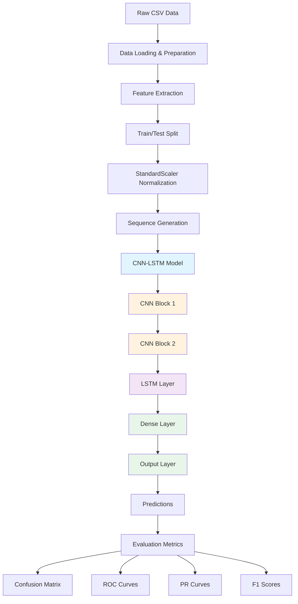

# CNN-LSTM Electrical Fault Classification

A hybrid deep learning pipeline for classifying electrical faults in transmission lines using time-series voltage and current measurements.

## 📊 Project Overview

- **Model:** Hybrid CNN-LSTM Architecture
- **Accuracy:** 78.01% on test set
- **Dataset:** 7,861 electrical measurements
- **Classes:** 6 fault types (No Fault, LG, LL, LLG, LLL, LLLG)

## 📦 Data Source

This project uses the **Electrical Fault Detection and Classification** dataset from Kaggle:
- **Dataset URL:** [https://www.kaggle.com/datasets/esathyaprakash/electrical-fault-detection-and-classification](https://www.kaggle.com/datasets/esathyaprakash/electrical-fault-detection-and-classification)
- **Features:** Time-series voltage and current measurements from transmission lines
- **Total Samples:** 7,861 electrical measurements
- **Format:** CSV files with multiclass and binary classification variants

## 🔗 Reference Project

This implementation is built with reference to a previous Kaggle notebook:
- **Reference Notebook:** [Electrical Faults Analysis & Classification](https://www.kaggle.com/code/harshsingh2209/electrical-faults-analysis-classification/notebook)
- **Author:** harshsingh2209
- **Enhancements:** Refactored into modular Python scripts, improved architecture, and comprehensive evaluation pipeline

## 📁 Project Structure

```
A Hybrid CNN - LSTM Model for fault detection in power distribution system/
├── src/                                    # Source code
│   ├── README.md                           # Source code documentation
│   ├── cnn_lstm_preprocessing.py           # Data preprocessing & sequence generation
│   ├── cnn_lstm_model.py                   # Model architecture definitions
│   ├── train_cnn_lstm.py                   # Training pipeline
│   └── evaluate_model.py                   # Evaluation & visualization
│
├── models/                                 # Trained models & artifacts
│   ├── best_cnn_lstm_model.h5              # Trained model weights (1.5 MB)
│   ├── scaler.pkl                          # Fitted StandardScaler
│   └── label_encoder.pkl                   # Label encoder
│
├── results/                                # Training results
│   ├── README.md                           # Results documentation
│   ├── visualizations/                     # Generated plots
│   │   ├── confusion_matrix.png
│   │   ├── training_history.png
│   │   ├── classwise_f1_scores.png
│   │   └── training_summary.png
│   └── metrics/                            # Performance metrics
│       ├── evaluation_metrics.txt
│       ├── training_history.csv
│       └── hyperparameters_log.json
│
├── data/                                   # Datasets
│   ├── classData.csv                       # Multiclass fault dataset (655 KB)
│   └── detect_dataset.csv                  # Binary fault detection dataset (952 KB)
│
├── docs/                                   # Documentation
│   └── README_CNN_LSTM.md                  # Detailed technical documentation
│
├── electrical-faults-analysis-classification.ipynb  # Jupyter notebook
├── electrical-faults-analysis-classification.py    # Converted Python script
├── model_architecture.txt                  # Model architecture summary
├── REFACTORING_SUMMARY.md                  # Project refactoring notes
└── README.md                               # This file
```

## 🚀 Quick Start

### Prerequisites

```bash
pip install tensorflow numpy pandas scikit-learn matplotlib seaborn
```

### Training

```bash
cd "c:\Users\HP\Downloads\A Hybrid CNN - LSTM Model for fault detection in power distribution system"
$env:PYTHONIOENCODING='utf-8'
python src/train_cnn_lstm.py
```

### Evaluation

```bash
python src/evaluate_model.py
```

## 📈 Results

### Overall Performance
- **Accuracy:** 78.01%
- **Precision:** 77.53%
- **Recall:** 78.01%
- **F1-Score:** 77.47%

### Class-Wise Performance
| Fault Type | Accuracy | F1-Score |
|------------|----------|----------|
| No Fault (0000) | 97.01% | 95.18% |
| LG Fault (1001) | 93.33% | 88.24% |
| LLG Fault (1011) | 88.50% | 88.11% |
| LL Fault (0110) | 80.50% | 86.10% |
| LLL Fault (0111) | 55.05% | 50.21% |
| LLLG Fault (1111) | 33.04% | 38.27% |

## 🏗️ Architecture

### Model Flow Diagram



### Layer Architecture

```
Input (10 timesteps, 6 features)
    ↓
Conv1D (64 filters) → BatchNorm → MaxPool → Dropout
    ↓
Conv1D (128 filters) → BatchNorm → MaxPool → Dropout
    ↓
LSTM (100 units, dropout=0.3)
    ↓
Dense (64, ReLU) → Dropout
    ↓
Dense (6, Softmax)
```

**Parameters:** 125,142 (488 KB)

**Detailed Architecture:** See [`model_architecture.txt`](model_architecture.txt) for complete layer-by-layer breakdown

## 📚 Documentation

For detailed documentation, see [`docs/README_CNN_LSTM.md`](docs/README_CNN_LSTM.md)

## 🔬 Key Features

- ✅ **Temporal Awareness:** LSTM layer captures time-series patterns
- ✅ **Automatic Feature Learning:** CNN extracts relevant features
- ✅ **Production Ready:** Includes scaler and encoder for deployment
- ✅ **Comprehensive Evaluation:** Confusion matrix, F1 scores, training curves
- ✅ **Reproducible:** Fixed random seeds and hyperparameter logging

## 📊 Visualizations

All visualizations are automatically generated in `results/visualizations/`:

- **Confusion Matrix** - Prediction accuracy per class with heatmap
- **Training History** - Accuracy & loss curves over epochs
- **Class-wise F1 Scores** - Performance comparison across fault types
- **ROC Curves** - Receiver Operating Characteristic (One-vs-Rest) with AUC scores
- **PR Curves** - Precision-Recall curves with Average Precision scores

Run `python src/evaluate_model.py` to generate all visualizations.

## 🎓 Academic Use

This project was developed for a term paper on electrical fault classification. The implementation demonstrates:
- Deep learning for time-series classification
- Hybrid CNN-LSTM architecture
- Complete ML pipeline from preprocessing to evaluation

## 📝 License

Educational project for academic purposes.

## 👤 Author

Developed for academic purposes as part of a 400 level project on electrical fault detection and classification.
